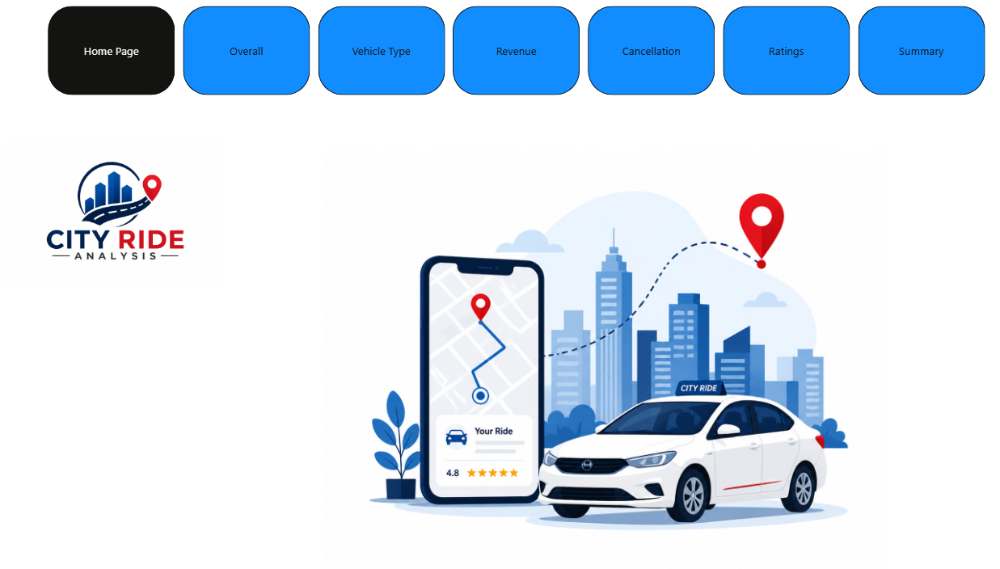
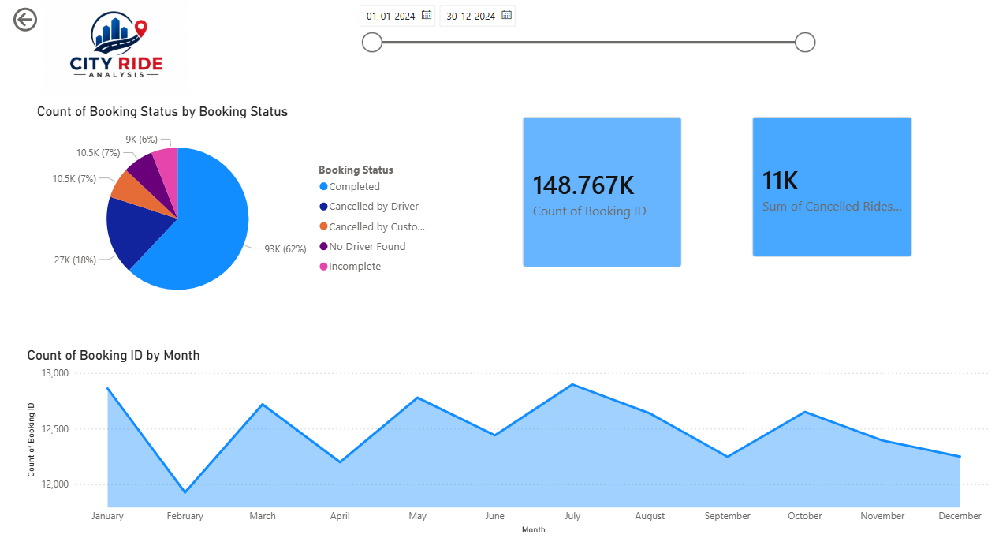
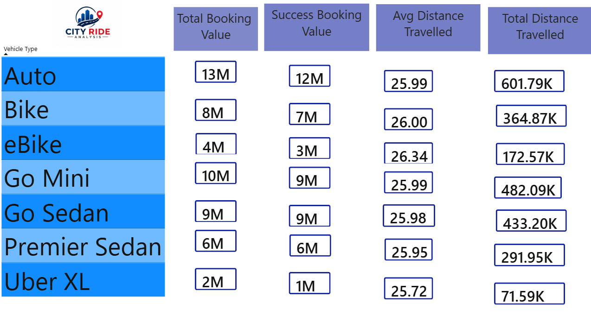
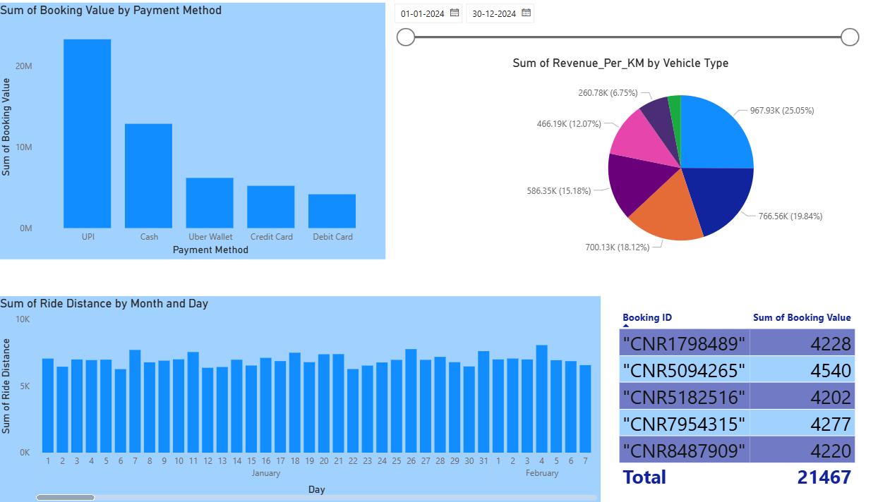
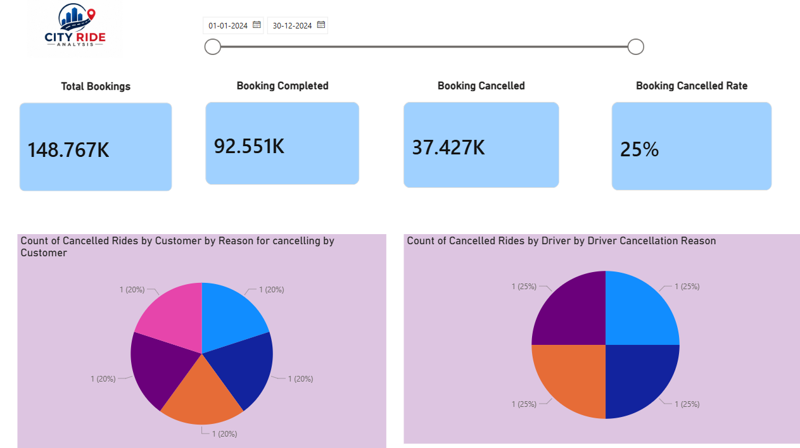
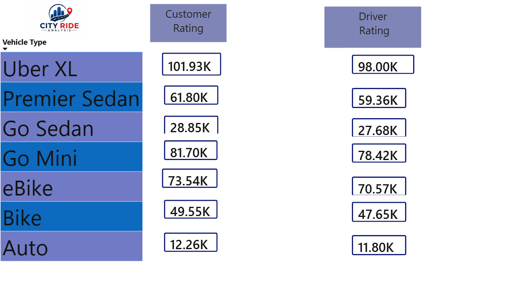
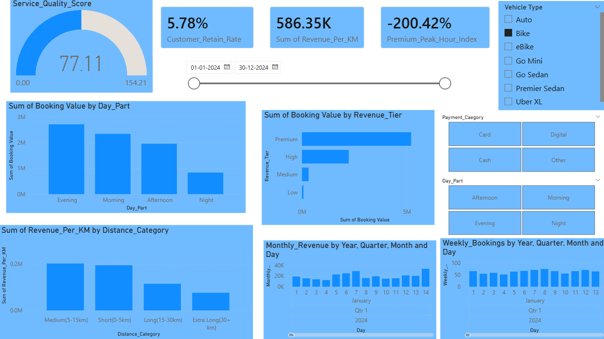

# 🚖 City Ride Analysis Dashboard

## 📊 Project Overview

The **City Ride Analysis Dashboard** is an interactive Power BI project designed to analyze ride-booking data and generate meaningful business insights. It helps in understanding customer behavior, revenue trends, booking patterns, and service performance across different vehicle types.

This dashboard enables data-driven decision-making for ride service platforms like Uber, Ola, etc.

---

## 🎯 Objectives

- Analyze booking trends over time  
- Track ride completion and cancellation rates  
- Evaluate customer and driver ratings  
- Identify revenue distribution across categories  
- Compare performance by vehicle type  

---

## 📌 Key Features

### 🏠 Home Page

- Navigation panel for different sections:
  - Overall
  - Vehicle Type
  - Revenue
  - Cancellation
  - Ratings
  - Summary  

📷 **Preview:**

---

### 📈 Overall Analysis

- Total Bookings: **148K+**
- Cancelled Rides: **11K+**
- Booking status distribution  
- Monthly booking trends  

📷 **Preview:**

---

### 🚗 Vehicle Type Analysis

- Comparison of:
  - Uber XL  
  - Premier Sedan  
  - Go Sedan  
  - Go Mini  
  - eBike  
  - Bike  
  - Auto  

- Customer vs Driver ratings  

📷 **Preview:**

---

### 💰 Revenue Analysis

- Revenue by distance:
  - Short (0–5 km)  
  - Medium (5–15 km)  
  - Long (15–30 km)  
  - Extra Long (30+ km)  

- Revenue tiers:
  - Low, Medium, High, Premium  

📷 **Preview:**

---

### ❌ Cancellation Analysis

- By Driver  
- By Customer  
- No Driver Found  

📷 **Preview:**

---

### ⭐ Ratings Analysis

- Customer Retention Rate: **5.78%**
- Service Quality Score: **77.11**
- Driver & Customer rating comparison  

📷 **Preview:**

---

### 📊 Summary Dashboard

- Booking trends (Weekly & Monthly)
- Time-based analysis (Morning, Evening, Night)
- Filters:
  - Date
  - Vehicle Type
  - Payment Method

📷 **Preview:**

---

## 🛠️ Tools & Technologies

- **Power BI** – Dashboard creation  
- **Excel / CSV** – Data source  
- **DAX** – KPIs & calculations  

---

## 📂 Project Structure

📁 City-Ride-Analysis
┣ 📊 taxxi.pbix
┣ 📄 README.md
┗ 📁 assets
┣ home_page.png
┣ overall.png
┣ vehicle_type.png
┣ revenue.png
┣ cancellation.png
┣ ratings.png
┗ summary.png

---

## 🚀 How to Use

1. Download the `.pbix` file  
2. Open in **Power BI Desktop**  
3. Navigate through dashboard pages  
4. Apply filters for custom insights  

---

## 📌 Insights Gained

- Majority bookings are successfully completed  
- Peak demand during evening hours  
- Premium rides generate highest revenue  
- Cancellation indicates driver availability issues  

---

## 🤝 Contributing

Feel free to fork and improve the dashboard.

---

## 📬 Contact

**Harshal Chavan**  
📧 harshalchavan683@gmail.com
🔗 www.linkedin.com/in/harshal-chavan-4347042b7